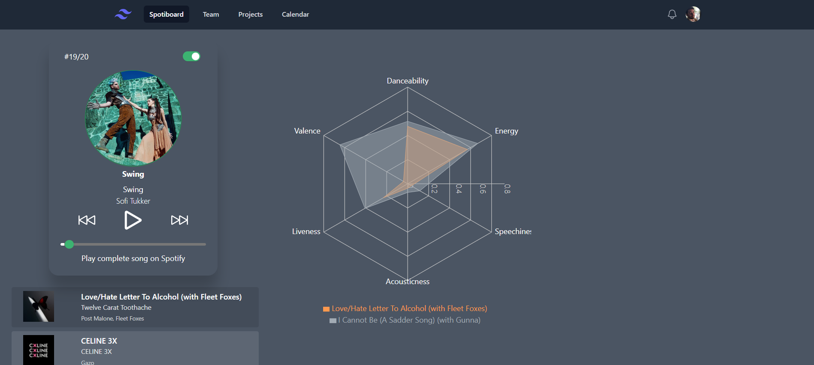

# Spotiboard

This project has been made using React, TailwindCSS, Recharts, Axios, Colr API and Spotify API.

## Available features
- List of your 20 most listened songs
- Functional player related to it
  - Show the position of current track (left top corner)
  - Possibility to disable the animation of rotating album cover (right top corner)
  - Diffuse extract of each songs
  - Previous, pause, play and next button
  - Possibility to remotely play on spotify the current song
- Chart displaying various datas about specific tracks
  - Available datas
    - Danceability
    - Energy
    - Speechiness
    - Acousticness
    - Acousticness
    - Valence
  - Add or remove a track to graph by clicking its div in the left list
  - Colors of graph are randomly generated by request to Colr API.

## Images

## Credits
Audioplayer: Based on the wonderful work of Ryan Finn (https://letsbuildui.dev/articles/building-an-audio-player-with-react-hooks)